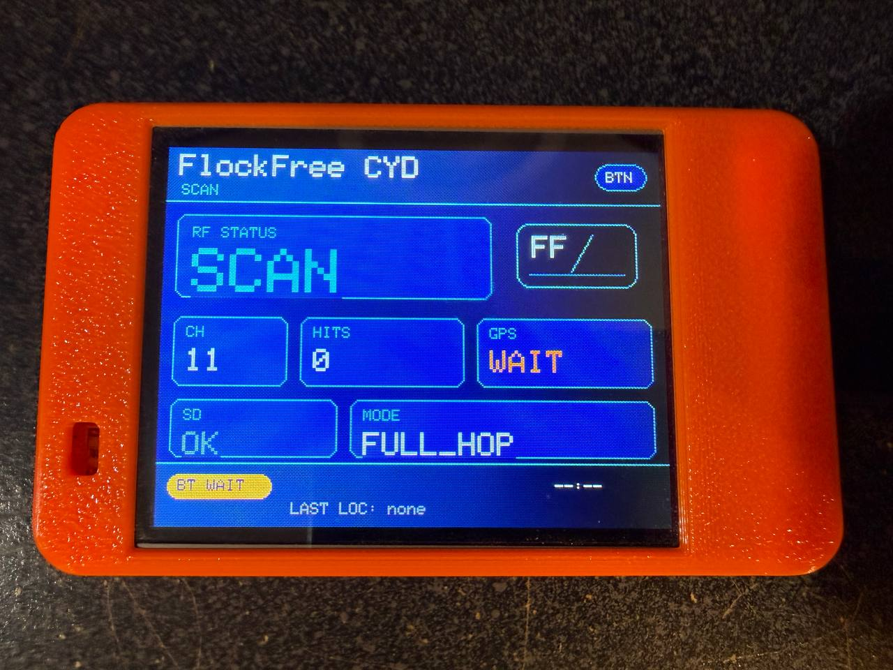

# CYD Flock-You

Cheap Yellow Display firmware for passive, human-reviewed Flock Safety / ALPR camera discovery. Pairs with [FlockFree Navigation](https://github.com/yetisoldier/FlockFree-Navigation) for the full mobile integration.



## What It Does

The CYD (Cheap Yellow Display / ESP32-2432S028R) passively monitors 2.4 GHz Wi-Fi traffic for known Flock-style RF signatures. When it detects a likely ALPR camera, it:

1. Logs the detection to SD card (`/flock.csv`)
2. Sends a JSON detection event over Bluetooth LE to the paired phone
3. Updates the TFT display with hit details
4. Chirps the buzzer and flashes the LED
5. Flashes a full-screen red **FLOCK FOUND** alert (touch to dismiss)

The phone app (FlockFree Navigation) receives the detection, places a review marker on the map, and lets you manually verify and submit it to OpenStreetMap. **Nothing uploads automatically.**

The CYD also continuously scans for Flock-style BLE signatures, with a live status indicator on the scan screen.

## Repository Pair

| Repository | Role |
|------------|------|
| [`yetisoldier/CYD-Flock-You`](https://github.com/yetisoldier/CYD-Flock-You) | ESP32 firmware (this repo) |
| [`yetisoldier/FlockFree-Navigation`](https://github.com/yetisoldier/FlockFree-Navigation) | Android app (OsmAnd fork) |

## Hardware Requirements

- **ESP32-2432S028R** (Cheap Yellow Display) — ESP32 with ILI9341 240×320 TFT
- **microSD card** (recommended, for CSV logging)
- **USB power bank** or stable USB power (the ESP32 is sensitive to power fluctuations)

### Pin Map

| Pin | Function |
|-----|----------|
| GPIO 4 | Red RGB LED (detection feedback, active low) |
| GPIO 5 | SD card CS |
| GPIO 12 | TFT MISO |
| GPIO 13 | TFT MOSI |
| GPIO 14 | TFT SCLK |
| GPIO 15 | TFT CS |
| GPIO 2 | TFT DC |
| GPIO 21 | TFT backlight |
| GPIO 26 | Piezo buzzer |
| GPIO 0 | Boot button / display control |

## Installation

### 1. Install PlatformIO

```bash
pip install platformio
```

Or via Homebrew (macOS):

```bash
brew install platformio
```

### 2. Clone and build

```bash
git clone https://github.com/yetisoldier/CYD-Flock-You.git
cd CYD-Flock-You
pio run -e cyd
```

### 3. Flash the firmware

Connect the CYD via USB to your computer:

```bash
pio run -e cyd -t upload
```

Or use the helper script:

```bash
./scripts/flash-cyd.sh
```

### 4. Verify

Open the serial monitor:

```bash
pio device monitor -e cyd
```

Type `FYHELLO` and press Enter. You should see a JSON response:

```json
{"event":"pair_status","device":"CYD-Flock-You","protocol_version":1,"features":["wifi_promisc","phone_gps","sd_csv","tft_status","ble_uart"],"gps":false,"sd":true,"detections":0,"csv_rows":0}
```

## Display

The CYD TFT shows a FlockFree-styled UI with navy/cyan/blue colors and danger accents:

- **Scan screen** — FF badge, current channel, hit count, GPS/SD/BLE status, local time
- **GPS screen** — Latest GPS fix details (from phone)
- **CSV Log screen** — SD card logging status and row count
- **Last Detection screen** — Most recent detection details (method, MAC, RSSI, channel)

### Display Controls

The CYD touchscreen and boot button control the display:

| Control | Action |
|---------|--------|
| Touchscreen tap | Cycle to the next display screen |
| Boot button press (GPIO 0) | Rotate the screen orientation |

The orientation cycles through landscape, portrait, landscape reversed, and portrait reversed. The firmware uses a portrait-aware layout, so the display content should stay inside the screen in both orientations.

The standard ESP32-2432S028R touch controller is an XPT2046 wired on a separate SPI bus from the TFT. This firmware reads it directly on GPIO 25/32/39/33 with IRQ on GPIO 36.

## Usage

### Pairing with FlockFree Navigation

1. Flash the CYD firmware (above)
2. Insert a microSD card if you want local CSV logging
3. Power the CYD from a stable USB source
4. Install [FlockFree Navigation](https://github.com/yetisoldier/FlockFree-Navigation/releases) on your Android phone
5. Open FlockFree → Menu → Plugins → FlockFree → Settings
6. Enable **CYD BLE hardware**
7. FlockFree scans and connects to `CYD-Flock-You` automatically
8. The CYD display should show `BT OK` and `GPS OK` once the phone connects and sends a fresh GPS fix

### During a Drive

1. Keep the CYD powered and the phone app open (or backgrounded — the BLE foreground service keeps the connection alive)
2. The phone streams GPS to the CYD once per second via `FYGPS`
3. When the CYD detects a likely ALPR camera:
   - The display changes from `SCAN` to `HIT`
   - The buzzer chirps and the LED flashes
   - A detection event is sent to the phone
   - FlockFree shows a toast and places a cyan diamond marker on the map
4. After the drive, review each CYD marker in FlockFree:
   - Tap the marker → **Review as ALPR camera**
   - Adjust the position from the vehicle path to the actual camera location
   - Set the camera direction manually
   - Submit through the OSM POI editor

### Bench Testing Without RF

1. Connect FlockFree to the CYD over BLE
2. Tap **Simulate CYD detection** in FlockFree settings, or send `FYSIM` over serial
3. A test detection appears in the app
4. Cancel it after verifying the flow

## Serial Commands

| Command | Description |
|---------|-------------|
| `FYHELLO` | Returns pairing/status JSON |
| `FYSTATUS` | Returns full telemetry JSON |
| `FYGPS,lat,lon,acc,speed,course,sats,hdop,unix_time,offset` | Phone GPS input |
| `FYSIM` | Simulate a detection for testing |
| `FYSCREEN,next` | Cycle to next display screen |
| `FYTOUCH` | Report raw touch diagnostic values |

Screen rotation is handled by the physical boot button. There is no serial rotation command yet.

## Bluetooth Protocol

| Parameter | Value |
|-----------|-------|
| Peripheral name | `CYD-Flock-You` |
| Service UUID | `6E400001-B5A3-F393-E0A9-E50E24DCCA9E` |
| RX (write) UUID | `6E400002-B5A3-F393-E0A9-E50E24DCCA9E` |
| TX (notify) UUID | `6E400003-B5A3-F393-E0A9-E50E24DCCA9E` |
| Line format | Newline-delimited text |
| Protocol version | 1 |

### Detection Event Format

```json
{
  "event": "detection",
  "detection_method": "wifi_wildcard_probe",
  "protocol": "wifi_2_4ghz",
  "mac_address": "70:c9:4e:aa:bb:cc",
  "oui": "70:c9:4e",
  "rssi": -63,
  "channel": 6,
  "frequency": 2437,
  "ssid": "",
  "gps": {
    "latitude": 45.171234,
    "longitude": -93.225678,
    "accuracy": 6.5,
    "age_ms": 250,
    "source": "phone"
  }
}
```

See [docs/deflock-pairing-protocol.md](docs/deflock-pairing-protocol.md) for full protocol details.

## CSV Log

When SD is available, detections append to `/flock.csv`:

```
millis,mac,oui,method,rssi,channel,frequency_mhz,lat,lon,accuracy_m,gps_age_ms,speed_kmph,course_deg,count
```

## Detection Methods

| Method | Description |
|--------|-------------|
| `wifi_wildcard_probe` | Probe request with wildcard SSID from a known OUI |
| `wifi_oui_addr2` | Transmitter address OUI match |
| `wifi_oui_addr1` | Receiver-side OUI match (quiet/sleeping infrastructure) |
| `wifi_oui_addr3` | BSSID OUI match (disabled by default) |
| `wifi_ssid` | SSID keyword match (flock, flck, test_flck) |
| `wifi_hidden_ssid` | Hidden beacon/probe-response from a known OUI |

Target OUI list: see [`datasets/NitekryDPaul_wifi_ouis.md`](datasets/NitekryDPaul_wifi_ouis.md)

## Forks and Credits

- Firmware fork: [`colonelpanichacks/flock-you`](https://github.com/colonelpanichacks/flock-you)
- Android app fork: [`FoggedLens/deflock-app`](https://github.com/FoggedLens/deflock-app)
- Wildcard probe signature and OUI research: [`DeflockJoplin/flock-you`](https://github.com/DeflockJoplin/flock-you)
- BLE manufacturer ID work: [`wgreenberg/flock-you`](https://github.com/wgreenberg/flock-you)
- DeFlock project: [deflock.me](https://deflock.me)
- Wi-Fi OUI research: ØяĐöØцяöЪöяцฐ / @NitekryDPaul

## Disclaimer

This is a passive research and privacy-auditing tool. It does not transmit Wi-Fi, authenticate to networks, or bypass access controls. Wireless reception and public infrastructure mapping laws vary by jurisdiction. Use responsibly, follow local law, and avoid submitting unverified data to OpenStreetMap.
